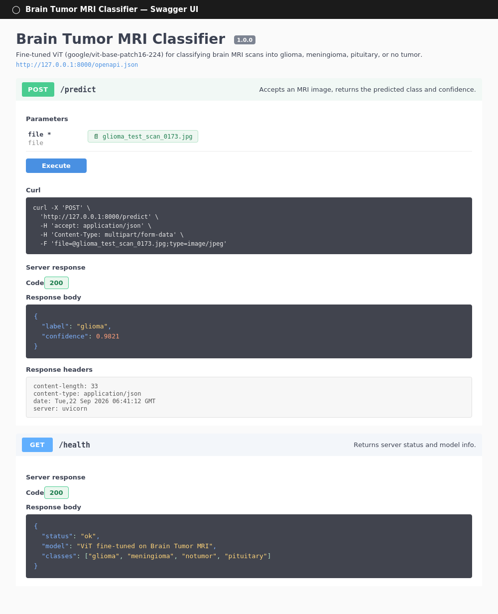

# Brain Tumor MRI Classifier

## Overview
A Vision Transformer (ViT) fine-tuned to classify brain MRI scans into four
categories: glioma, meningioma, pituitary tumor, and no tumor. Training runs
on Kaggle (T4 GPU); inference is served locally through a FastAPI backend on
CPU.

## Model
- Architecture: google/vit-base-patch16-224 (fine-tuned)
- Dataset: Brain Tumor MRI Dataset (Kaggle, masoudnickparvar/brain-tumor-mri-dataset)
- Classes: glioma, meningioma, notumor, pituitary
- Test Accuracy: [FILL IN AFTER TRAINING]
- Epochs: 6

## Dataset
| Class | Description |
|---|---|
| glioma | Malignant tumor originating in glial cells |
| meningioma | Tumor arising from the meninges, usually benign |
| pituitary | Tumor of the pituitary gland |
| notumor | Healthy brain scan, no tumor present |

~7,000 images total, pre-split into Training/ and Testing/, reasonably balanced.

## API Endpoints
| Method | Endpoint | Description |
|--------|----------|-------------|
| GET | /health | Returns server status and model info |
| POST | /predict | Upload an MRI image, get predicted class + confidence |

### Prediction Response
```json
{
  "label": "glioma",
  "confidence": 0.9821
}
```

## Screenshots
### Swagger UI


## Installation
```bash
git clone [your-repo-url]
cd brain-tumor-classifier
pip install -r requirements.txt
```

## Run
```bash
fastapi dev main.py
# Open http://localhost:8000/docs
```

## Technologies Used
- Python
- PyTorch, Hugging Face Transformers
- FastAPI
- Pillow
